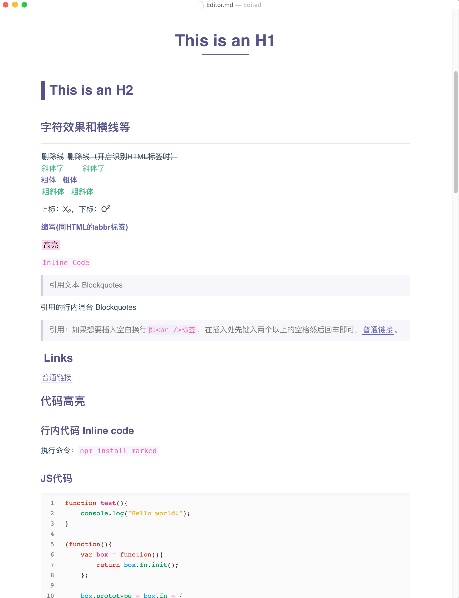
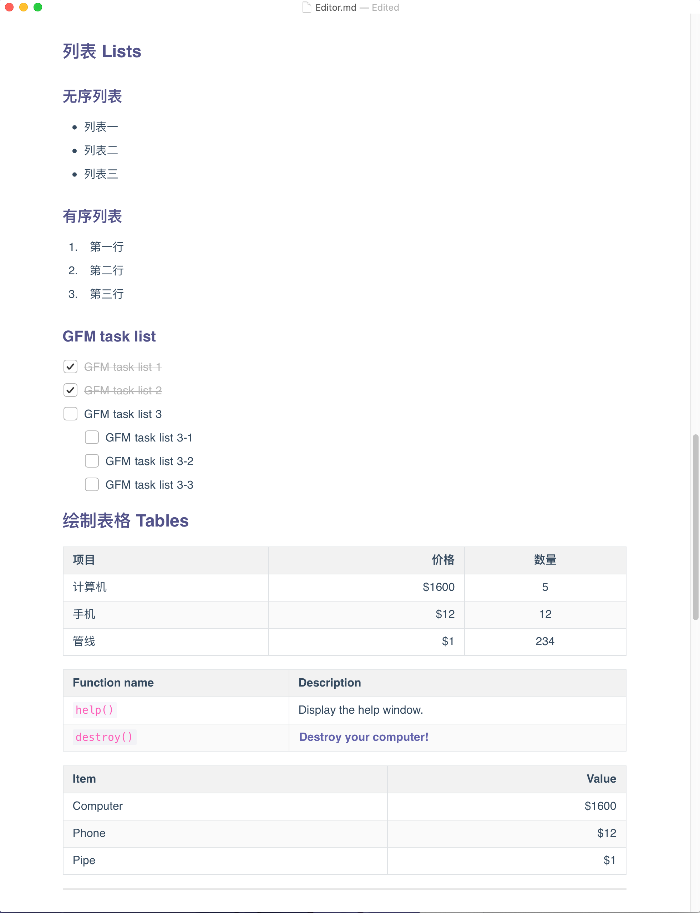

`简单, 干净`,  自制的 Typora 主题,  [下载地址](https://github.com/hliu202/typora-purple-theme.git)

本人的[第一篇知乎文章](https://zhuanlan.zhihu.com/p/165151336),  就是介绍本主题,  收获20个赞（好像也不多）, but coooool

<!--more-->

## 简介

[Typora](https://www.typora.io/)是一款支持实时预览的 Markdown 编辑器和阅读器，支持`Windows`、`macOS`、`Linux`三大平台。Typora 作为一款合格的 Markdown 编辑器，支持图片、列表、表格、代码、公式、目录等功能，同时这款软件还支持（一键）动态预览功能，让一切都变得如此干净、纯粹。并且有多种主题模板。

## 安装主题

1. [下载](https://github.com/hliu202/typora-purple-theme)本主题中的`purple.css`文件；
2. 打开 Typora，点击“**偏好设置**” => “**打开主题文件夹**”按钮，将弹出 Typora 的主题文件夹；
3. 将下载好的`purple.css`放到 Typora 的主题文件夹中；
4. 关闭并重新打开 Typora，从菜单栏中选择 “**主题**” => “**Purple**” 即可。

## 效果图

## Ref

[typora-vue-theme](https://github.com/blinkfox/typora-vue-theme)

[typora-theme-ursine](https://github.com/aCluelessDanny/typora-theme-ursine)

[theigrams/My-typora-themes](https://github.com/theigrams/My-typora-themes)

[Typora样式研究](http://downgoon.com/2018/07/Typora样式研究/)

