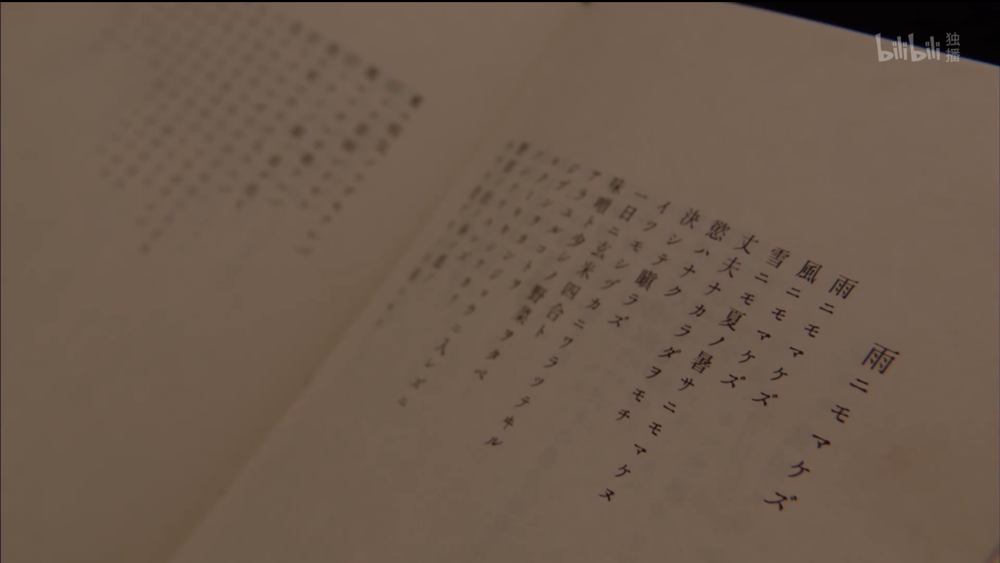
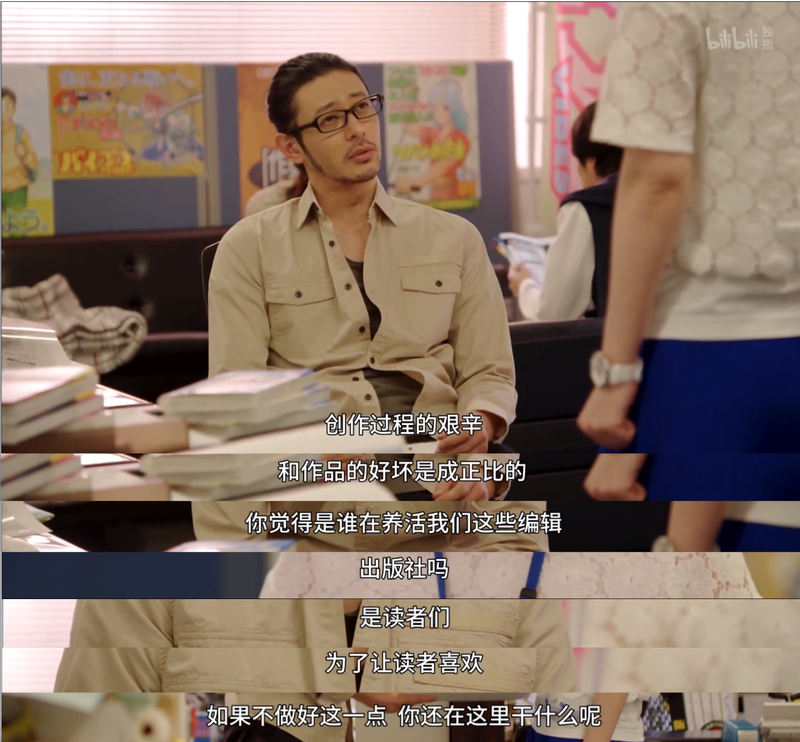
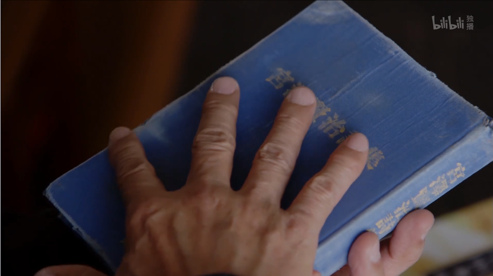
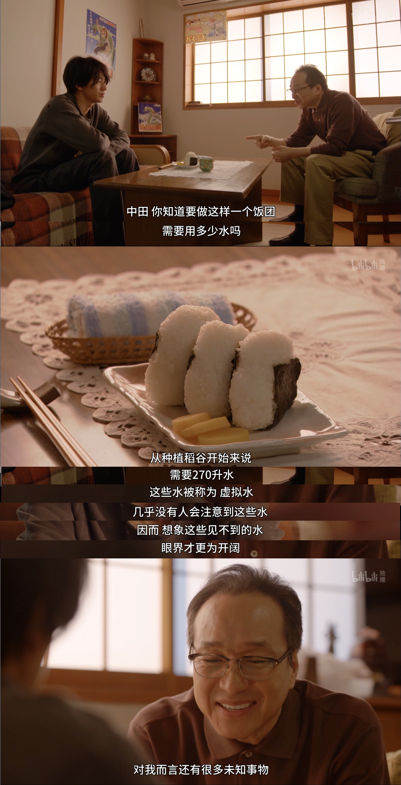

看完了[《重版出来！》](https://www.bilibili.com/bangumi/media/md28229806/?spm_id_from=666.25.b_6d656469615f6d6f64756c65.2)，豆瓣9.2分励志好剧，bilibili评分9.9分，比黑木华另一部主演的日剧[《凪的新生活》](https://www.bilibili.com/bangumi/media/md28225999/?from=search&seid=2141870212740728779#detail)的9.7分还高，看过的都说好？

催泪又热血的奋斗日常，引起很多的「共情」和「悟到了」。

> 看日剧的时候，总想记台词和画面，哈哈

<!--more-->

## 1. 精力善用

第1集

## 2 付出 与 收获

第3集

> 创作过程的艰辛，和作品的好坏是成正比的～

## 3. 不畏风雨 与 行善

第5集

不畏大雨   不畏狂风   不畏冬雪与酷暑

我身强健   不惧不怒   我心无欲

无论何时静静微笑   日食四合粳米   味噌与蔬菜少许

所有一切   不以物喜   不以己悲

洞悉世事   铭记于心

原野松林庇荫处   寄居赋闲茅草屋

东方孩童病痛   我自前去诊治

西方老妪艰辛   我便帮其劳作

南方有人将死   我去劝慰安抚

北方兵戈四起   我来化解干戈

孤独时拭干眼泪   寒暑交替何所去

人尝道我无情   没有掌声   不识辛劳

如此这般   我之所愿

——《不畏风雨》（宫泽贤治诗集）

>宫泽贤治37年的短短一生中共创作了八百多首诗，绝大多数没有公开发表，少量集结成诗集《春与阿修罗》，以自费方式出版。这些作品在他生前乏人问津，却在他逝世后广受欢迎，他本人也成为日本家喻户晓的国民作家，他的诗作中最为人称道的，是这首《不畏风雨》
>
>宫泽贤治1896年生于日本东北贫瘠的岩手县，这里不仅是全日本最穷的一个县份，而且风灾、雨灾不断，当地农民的生活非常困苦。[更多](https://www.douban.com/note/708481914/)

## 4. 上善若水 与 眼界

第10集 virtual water，哈哈哈

