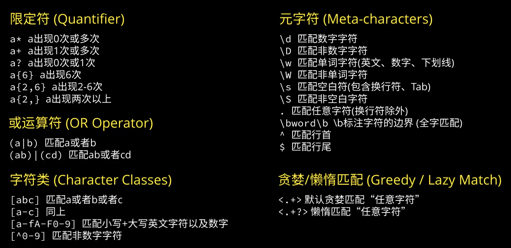

b站上看的优秀教程： [10分钟快速掌握正则表达式](https://www.bilibili.com/video/BV1da4y1p7iZ)



<!--more-->

测试网站：https://regex101.com/

## Greedy vs Lazy

前者会匹配最长满足条件的

后者会匹配最短满足条件的

## 简单例子：如何匹配颜色

注意`{6}`和`\b`

```
#[a-fA-F0-9]{6}\b
```

## 复杂例子：如何匹IPv4地址

```
\b((25[0-5]|2[0-4]\d|[01]?\d\d?)\.){3}(25[0-5]|2[0-4]\d|[01]?\d\d?)\b
```

注意：

- 先匹配单个数字：0-255
- `[01]?\d\d?`匹配 0-199 (包括000等)
- 末尾数字后没有`.`号
- 开头和结尾的`\b`，否则会匹配 5**12.0.0.0**

测试见：https://regex101.com/r/LH5H3d/3