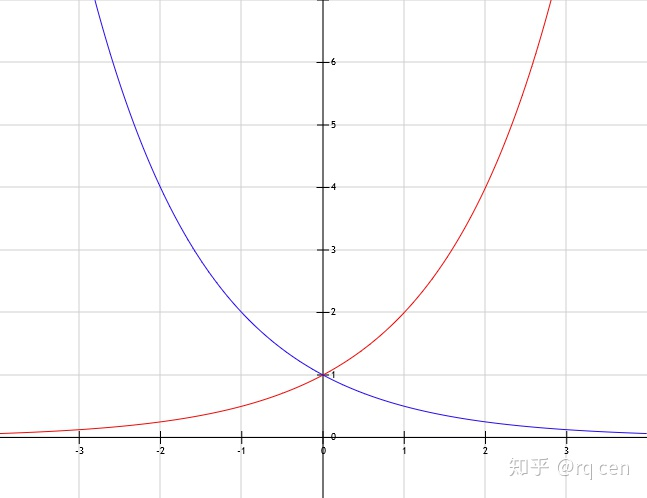
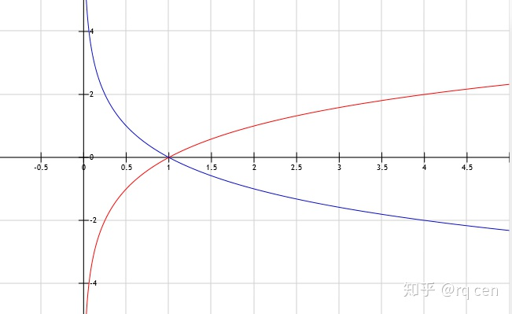
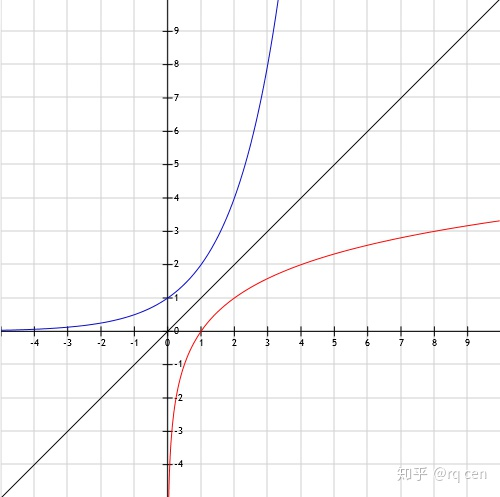

学习知乎专栏：[兴趣使然的数学基础讲义](https://zhuanlan.zhihu.com/c_1145370954870927360) 

>基础概念学扎实就没有解不出的题

<!--more-->

## 幂

乘法 类比

> a*b

a 叫**乘数**，b 叫**被乘数**，结果叫 **a 与 b 的积**，表示 **b 个 a 相加**(a+a…+a)

幂运算表示若干个相同的数相乘(a\*a…*a)：

> ab 也写作 a^b

表示 **b 个 a 相乘**，a 叫**底数**，b 叫**指数**，结果叫作**a的b次幂**。

### 幂的运算

幂的相乘

> am*an = am+n

幂的幂

> (am)n = amn 

幂的相除

> am / an = am-n  (m≥n，a≠0）

幂的展开

>(ab)m = ambm

当指数为0

> a0 = 1

表示有0个a相乘，任何数与0个其他数相乘(也就是不合其他数相乘)，还是它本身，相当于乘了个1

>b\*a0 = b\*1，所以a0 不能是 0
>
>am / am = a0，也有意义

当指数为负数

> a-m = 1 / am = a0 / am 

当指数为分数

> a1/m
>
> (a1/m)m = b m ,  then  bm = a, then b = m√a

## 指数函数

> f(x) = ax

### 单调性

> a>1时，增函数：当 x<0时，0＜f(x)＜1，当x=0时，f(x)=1，当x＞0时，f(x)＞1
>
> 0＜a＜1时， 减函数：当x＜0时，f(x)＞1，当x=0时，f(x)=1，当x＞0时，0＜f(x)＜1

类比：

在加法里，0个a相加的结果是0，任何数加上正数（大于零的数）会变大，任何数加上负数（比零小的数）会变小。

> 类比 f(x) = Ax

在乘法里，0个a相乘的结果是1，任何数乘以大于1的数会变大，任何数乘以比1小（比0大）的数会变小。

> 类比 f(x) = ax

### 对称性

单个指数函数，既不是奇函数也不是偶函数，但两个指数函数之间有对称性

对任意 a > 0，f(x) = ax 与 g(x) = (1/a)x 关于 y 轴镜面对称

类比：

对于一次函数f(x)=ax 和 g(x)=-ax，它们的值是互为相反数的，f(-x)=g(x)

对于 f(x) = ax 和 g(x) = a-x ，对相同的x，它们的值是互为倒数的，对互为相反数的x和-x，它们的值是相同的，它们两的图像关于y轴对称，且都过点（0，1）

### 界限

当 m > 0 时，无论是对 a 开方，还是 a 越乘越多：

当底数a＞1时，am 恒大于 1，比如 1.0012 > 1，2√1.001 > 1

当底数0 < a < 1时，am 恒小于 1

当 m < 0 时

当底数a＞1时，am 恒小于 1

当底数0 < a < 1时，am 恒大于 1

类比：

对于加法，一个数（≠0）乘以-1就会得到它的相反数，正数变负数，负数变正数。

对于乘法，一个数（＞0）去除1（或者说用1去除以它）会得到它的倒数，比1大的数的倒数比1小，比1小的数的倒数比1大。

## 对数

对于已知底数a和它的幂N，倒过来求指数的运算叫作对数运算，这个运算（对数）记作

> logaN
>
> 读作“**以a为底N的对数**”，在这里a依然叫作“**底数**”，N叫作“**真数**”。
>
> ab = N => b = logaN

### 运算法则

加法：logaM + logaN = loga(M*N)

减法：logaM - logaN = loga(M/N)

取幂：logaMn = nlogaM 

换底公式：logab = logcb / logca

### 自然对数的底

e = lim (1 + 1/n)n   n -> ∞

写作：ln

10 为底的对数写作：lg

### 对数函数

红色： f(x) = log2x 蓝色：g(x) = log1/2x

单调性：底 a 为 (0,1) 和 a > 1时

对称性：a 和 1/a 为底，关于 x 轴对称

逆函数：对数函数 f(x) = log2x 与指数函数 g(x) = 2x 互为逆函数（a＞0，a≠1）

