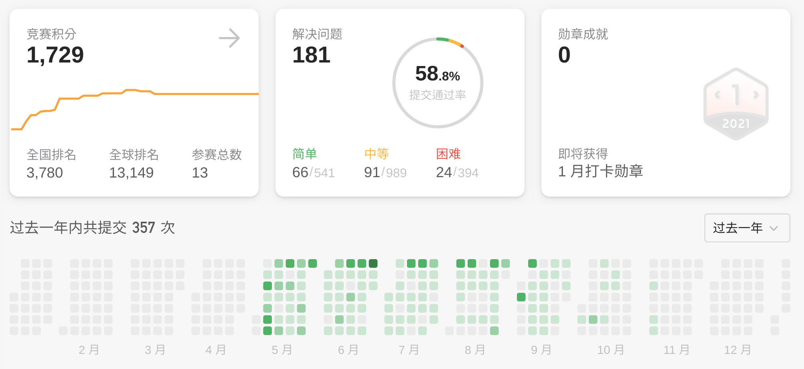
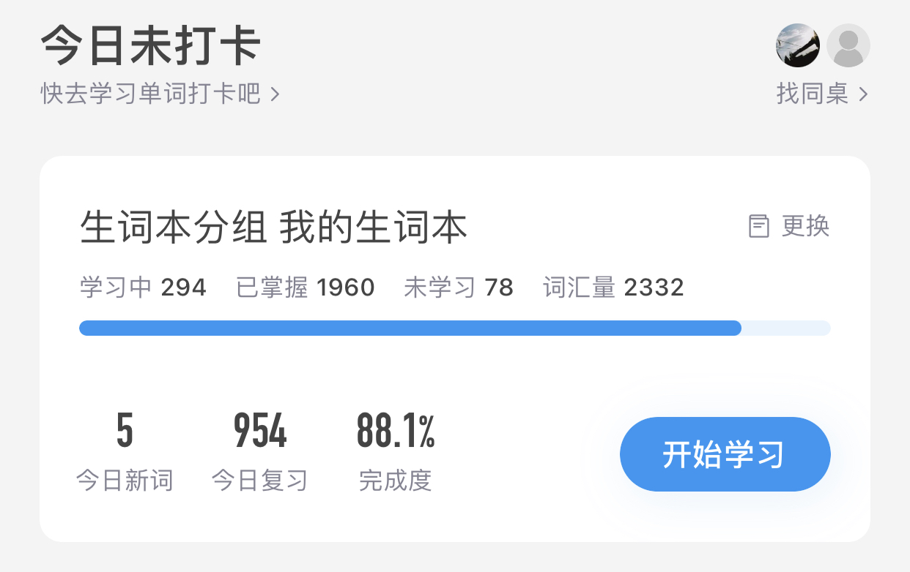
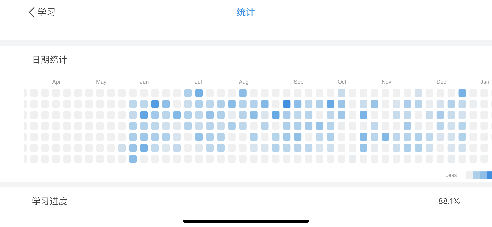
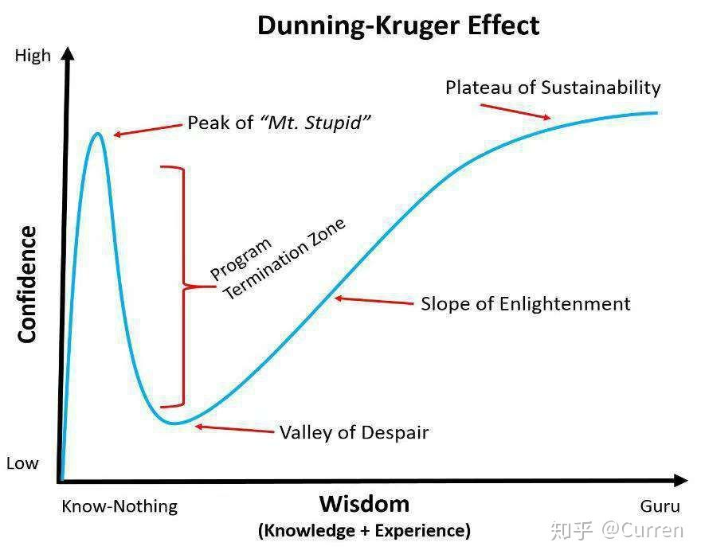

<iframe frameborder="no" border="0" marginwidth="0" marginheight="0" width=330 height=86 src="//music.163.com/outchain/player?type=2&id=1326836396&auto=0&height=66"></iframe>

又到了「新年决心效应」的时候了，先要回顾过去，才能展望未来。

关键词：`编译优化`，`C++`，`GCC`，`Jemalloc`，`zsh`，`VS Code`

<!--more-->

# 学习篇

## 读书

基本专业类书籍都处于未完成状态，TODO，深陷「新年决心效应」了。

科普类：《文明之光》，《自控力》，《高效能人士的 7 个习惯》，《刻意练习》，《番茄工作法》。

> 如果要推荐一本的话，最喜欢的是《**刻意练习**》，对其中「动机」和「停滞状态」的讲解有很强的既视感。

小说类：《活着》，《坏小孩》，《隐秘的角落》，《史记》

## Leetcode

练习了一段时间的LeetCode，后面因为太忙就没有继续了。计划是完成365题，实际181，算是完成一半吧。

除了每天的`daily`练习，还参加每周末的测试，主要的障碍是最后一道「困难题」总是做不出来（[测试结果](https://github.com/hliu202/leetcode-py/blob/master/weekly-contest/res.md)）。需要专门针对性的训练才行（刻意练习？），否则再做下去也没有太多提升。

## 英语单词

查单词和背单词软件：欧路词典。

遇到不会的单词就查，结果积累了2K多个，上班路上地铁上背背，结果怎么越背越多。今日复习快1K个了，也没法删除。

# 工具篇

## Shell环境

### zsh

进一步熟悉`zsh shell`，得心应手，回不去`bash`了。

目前的主题：powerlevel-10k，pure

最爱的Plugin：zsh-autosuggestions，zsh-history-substring-search，fast-syntax-highlighting

### Tilix

之前是用terminator，Tilix更简洁一些。

主题：Dracula

### Shell Script

也写了很多utils脚本，使得shell界面下各种操作都很方便

### VIM

get了几个高级功能：

1. `ctrl + v`编辑列
2. `ddp`, `yyp` 剪切，拷贝
3. `C` 修改(change)

## Git

之前只是会用基本功能，现在get到几个高级功能，好用到飞起：

1. `grl` (git ref log)
2. `grbi` (git rebase -i)
3. `gapa` (git add --patch)

## VS Code

主要开发环境。新Get了更多更强功能

主题：Dracula

Clang-Format：格式化代码

C/C++：怎样debug

其他功能：remote ssh，自动sync settings

最爱的Plugin：Bracket Pair Colorizer 2, Windows Color，File Utils，hightlight-words

## Typora

用来写博客和文档的最佳选择，第一次用就被惊艳到了，没想到Markdown还能这么直观，一句话「所见即所得」。

主题：[typora-purple-theme](https://github.com/hliu202/typora-purple-theme)。第一次自己定制主题，以前对`CSS`一点都不熟，想不到还很有乐趣，也学到很多。而且获得了90 star了，受到别人的认同，很有成就感。

熟悉`CSS`后，还能定制自己的html文档，比如GCC官方文档太朴素，自己做了带颜色的 [colored-gcc-html-docs](https://github.com/hliu202/colored-gcc-html-docs)。

# 工作篇

由于需要保密，工作内容能讲的不多，好在有一部分是已经开源的了。

## GCC

从去年5月份就开始主要用GCC，但只是使用GCC测试和调参，并没有深入了解代码。

今年5月份，终于向GCC社区提交了第一个patch：[extend cselim to check non-trapping for more references (PR tree-optimizaton/89430)](https://www.mail-archive.com/gcc-patches@gcc.gnu.org/msg236654.html)。解决一个优化问题，提升性能。总算是迈入GCC门槛了。以后需要以此为契机，总结一下是如何从0到1的。

随后又有幸参与一个新PASS的实现，算是深入了解GCC Middle End和Back End，从1到5吧（如果高手是10的话）。

## Jemalloc

向Jemalloc提交了一个patch：[allow to specify larger slab sizes #1930](https://github.com/jemalloc/jemalloc/pull/1930)。更深入了解Jemalloc，以后需要以此为契机，总结Jemalloc代码。

# 总结

用于学习和工作的时间还是不够多，效率也不高，导致年初的计划都没有完成，但这也在预计中了，毕竟就没有哪一年完成了。

如果说往年的计划完成度是20%的话，今年算是完成40%，还是有很大进步了。而且今年更积极主动了，不是被动学习和工作。学到的新东西也比之前多很多。加油，争取2021年的计划能圆满实现。

目前应该在绝望之谷了，就差2021年及之后的持续进步了：

